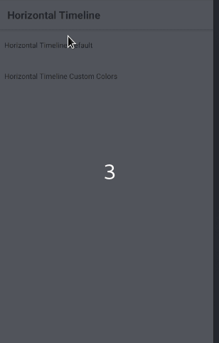

# react-native-horizontal-timeline

A horizontal scrollable timeline with month days

## Installation

```
npm i react-native-horizontal-timeline --save
```

## How to use it

**First step:** import the component:

```javascript
import { HorizontalTimeline } from 'react-native-horizontal-timeline';
```

**Second step:** use it with the required props

```javascript
<HorizontalTimeline date={new Date().toISOString()} />
```



#### Properties

| Prop | Description | Default |
|---|---|---|
|**date(required)**|Valid string used in the Date() constructor, example: '2018-01-10', '2013-07-02T09:00:00', etc | *None* |
|**data**|Object in the format of { <number> : { marked: <boolean>, info: <string> },... }, the number represents the day in the timeline, marked will bring an elevation to the day and you can also provide a information to be displayed below the dot image | *None* |
|**backgroundColor**|backgroundColor passed to each View of Day container| *#fefefe* |
|**color**|color of the text's of the component| *#ac78fb* |
